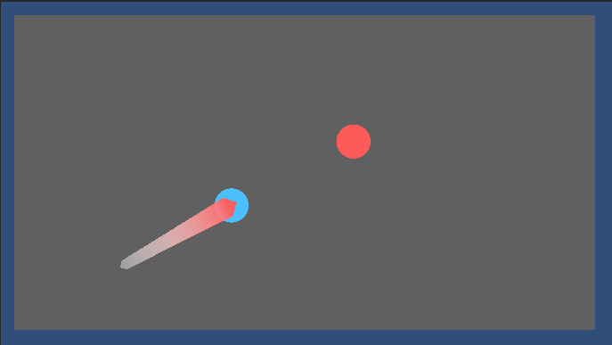

# Coin Of The Hill

This is a turn based, two player game in which each player attempts to knock the other player's coin out of the map. It was made for the LMC2410 individual digital game assignment. The only control necessary is to use the mouse/cursor to drag and shoot.

## Project Setup
This game is a Unity project. To access it, download the project as a ZIP, extract the folder, and open it as an existing project through Unity Hub.
